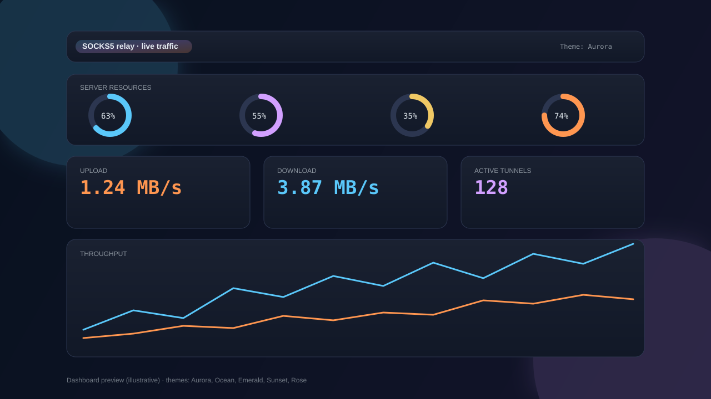

# SOCKS5 Auth Relay

پروکسی SOCKS5 احراز هویت‌شده با داشبورد مدیریت زنده.



---

## معرفی

این ابزار یک لایه SOCKS5 احراز هویت‌شده روی یک پروکسی SOCKS5 بالادست ایجاد می‌کند. کلاینت‌ها با نام کاربری و رمز عبور به این رله متصل می‌شوند و ترافیک به پروکسی بالادست منتقل می‌گردد. یک داشبورد وب نیز برای نظارت و کنترل لحظه‌ای در اختیار ادمین قرار می‌دهد.

---

## ویژگی‌ها

- پروتکل **SOCKS5** با احراز هویت نام کاربری/رمز عبور
- داشبورد وب تعاملی با به‌روزرسانی لحظه‌ای آمار
- نمایش **اتصال‌های زنده**، بایت‌های آپلود/دانلود، و سرعت لحظه‌ای
- جدول زنده اتصال‌های فعال به تفکیک IP و مقصد
- محدودیت **پهنای باند** (KB/s) قابل تنظیم از داشبورد
- محدودیت **تعداد اتصال** کل و به ازای هر کلاینت
- **whitelist** کلاینت‌های مجاز (IP یا CIDR)
- **GeoIP** برای نمایش کشور مقصد
- مسدود کردن مقصدها از داشبورد
- احراز هویت ورود به پنل مدیریت
- محدودیت IP برای دسترسی به پنل
- قابل اجرا روی ویندوز و لینوکس

---

## نیازمندی‌ها

- Python 3.11 یا بالاتر
- بدون نیاز به نصب کتابخانه خارجی

---

## نصب و اجرا

```bash
git clone <repo-url>
cd SOCKSshare
python main.py
```

تنظیمات از فایل `settings.json` در همان پوشه خوانده می‌شود. این فایل بهتر است فقط به صورت محلی نگهداری شود و داخل ریپو commit نشود. در صورت نبود این فایل، با مقادیر پیش‌فرض ساخته می‌شود.

نمونه تنظیمات عمومی و امن را می‌توانید از فایل `settings.example.json` بردارید.

---

## فایل `settings.json`

| فیلد | نوع | توضیح |
|------|-----|-------|
| `upstream_proxy` | string | آدرس پروکسی SOCKS5 بالادست |
| `upstream_port` | int | پورت پروکسی بالادست |
| `proxy_ip_listen` | string | آدرس bind برای پورت SOCKS5 محلی |
| `proxy_port` | int | پورت SOCKS5 محلی |
| `site_ip_listen` | string | آدرس bind برای داشبورد وب |
| `site_port` | int | پورت داشبورد وب (0 = غیرفعال) |
| `default_socks_user` | string | نام کاربری پیش‌فرض برای کلاینت‌ها |
| `default_socks_password` | string | رمز عبور پیش‌فرض برای کلاینت‌ها |
| `login_need` | bool | فعال‌سازی ورود به پنل مدیریت |
| `login_user` | string | نام کاربری پنل مدیریت |
| `login_password` | string | رمز عبور پنل مدیریت |
| `bandwidth_limit_kbps` | int | محدودیت پهنای باند کل (کیلوبایت/ثانیه، 0 = بدون محدودیت) |
| `max_conn_total` | int | حداکثر اتصال‌های همزمان (0 = بدون محدودیت) |
| `max_conn_per_client` | int | حداکثر اتصال به ازای هر IP کلاینت (0 = بدون محدودیت) |
| `geoip_enabled` | bool | فعال‌سازی جستجوی GeoIP برای مقصدها |
| `auth_required` | bool | الزام احراز هویت کلاینت SOCKS5 |
| `panel_ip_restricted` | bool | محدود کردن دسترسی داشبورد به IP های مشخص |
| `allowed_panel_ips` | list | لیست IP های مجاز برای دسترسی به داشبورد |

---

## داشبورد وب

پس از اجرا، داشبورد در آدرس زیر در دسترس است:

```
http://<آدرس-سرور>:<site_port>
```

به صورت پیش‌فرض داشبورد روی `127.0.0.1` اجرا می‌شود. اگر آن را روی آدرس عمومی مثل
`0.0.0.0` bind می‌کنید، حتماً `login_need` یا `panel_ip_restricted` را فعال نگه دارید؛
برنامه از اجرای داشبورد عمومی بدون login و بدون IP ACL جلوگیری می‌کند.

### امکانات داشبورد

- **آمار لحظه‌ای**: اتصال‌های زنده، بایت آپ/دان، سرعت لحظه‌ای
- **جدول اتصال‌های فعال**: IP کلاینت، مقصد، بایت مصرفی، کشور
- **کنترل پهنای باند**: تنظیم و اعمال آنی محدودیت KB/s
- **کنترل تعداد اتصال**: تنظیم سقف کل و به ازای هر کلاینت
- **مسدود کردن مقصد**: بلاک مستقیم آدرس‌ها از جدول اتصال‌ها
- **قطع همه تانل‌ها**: با یک کلیک همه اتصال‌های فعال قطع می‌شوند
- **تغییر رمز عبور**: بدون نیاز به ری‌استارت سرویس
- **تغییر پورت**: rebind لایو بدون ری‌استارت

### نکته امنیتی

خروجی‌های زنده داشبورد رمز SOCKS5 را در پاسخ‌های auto-refresh برنمی‌گردانند. نمایش یا تولید
کانفیگ دارای credential فقط با درخواست صریح از داخل پنل انجام می‌شود.

---

## لایسنس

MIT
